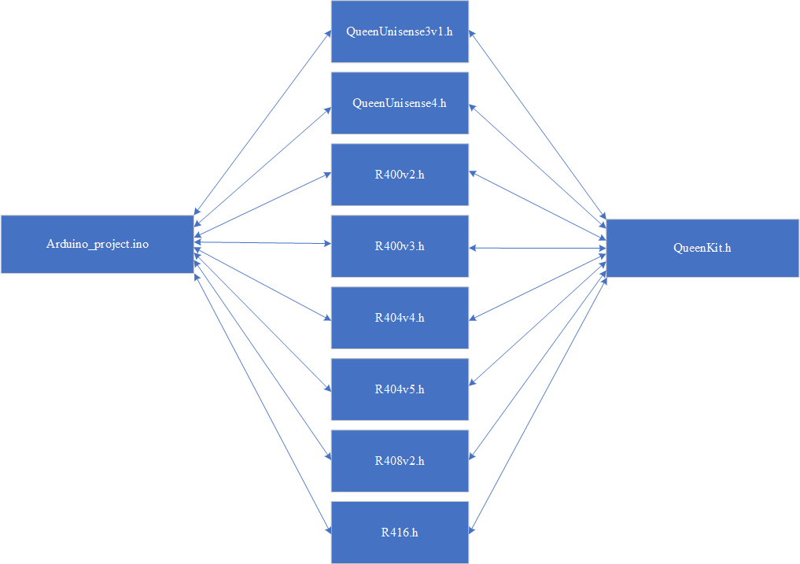

[Скачать](https://github.com/Anon242/QueenKit/archive/refs/heads/main.zip) 
# Описание
Бибилотека QueenKit для системы Queen.

# DF Player   
Каждая плата оснащена пинами для работы с DF плеером, что бы включить его, необходимо перед добавлением класса платы прописать:   
```c++
#define DF_PLAYER // Перед классом
#include <R400v3.h>
```
Define включит плеер со стандартными оффсетами трек - 16,10 и громкость 26,10, если нужны другие оффсеты, нужно прописать следующее:
```c++
#define DF_PLAYER
#define DF_PLAYER_TRACK 96 // Оффсет 96,10
#define DF_PLAYER_VOLUME 106 // Оффсет 106,10
#include <R400v3.h>
```
Использовать плеер можно и без #define DF_PLAYER инициализировав класс напрямую:
```c++
QueenPlayer player;
void setup()
{
  player.init(); // Инициализация плеера, включение программного Serial
}
void loop()
{
  player.play(1,30); // Трек , громкость (макс 30)
}
```
> [!CAUTION]
> В этом случае прописывать #define DF_PLAYER не нужно.

# Примеры
> [!TIP]
> Примеры для каждой платы находятся в папке examples.


### Пример для работы с платой R400v3:
```c++
// Получаем класс необходимой нам платы, в данном случае плата R400v3
#include <R400v3.h>

// Назначем ему ID
#define DEVICE_ID 1

// Создаем экземпляр класса платы, в параметр пишем нужный ID
Board queen(DEVICE_ID);

void setup()
{
  // Инизиализируем плату, настройка пинов, включение serial.
  // В параметр даем функцию onMessage, которую будет вызыватся каждый раз, когда данные получены из шины.
  // Если связь с шиной нам не нужна, параметр можно оставить пустым.
  queen.init(onMessage);
}

void loop()
{
  // Слушаем шину, обрабатываем данные, как только данные получены, вызовет метод onMessage()
  queen.loop();
}

// Метот который будет вызываться, как только данные будут получены
void onMessage()
{
  // Выставляем состояния выходных пинов данными из шины.
  // Обратите внимание, вызывать getBits и setBits разрешено только в этом методе!
  queen.out(queen.getBits(0, 4));
  // Отправляем в шину состояния входных пинов
  queen.setBits(0, 3, queen.in());
}

```
### Пример для работы с платой QueenUnisense4:
```c++
#include <QueenUnisense4.h>

#define DEVICE_ID 1
Board queen(DEVICE_ID);

void setup() { queen.init(onMessage); }

void loop() { queen.loop(); }

void onMessage() {
  // Получаем буфер ADC
  uint16_t *adcBuffer = queen.inADC();
  for (uint8_t i = 0; i < 16; i++) {
    uint8_t bitIndex = 36 + 10 * i;
    // Назначаем PWM из шины
    queen.pwmOuts(queen.getBits(bitIndex, 10), i + 1);
    // Отправляем данные ADC в шину
    queen.setBits(bitIndex, 10, adcBuffer[i]);
  }
  // Отправляем цифровые пины в шину
  queen.setBits(0, 32, queen.in());
}

```
# Структура  
  

Структура состоит из 3 основных элементов, слева направо:  
1) Arduino_project.ino - ваш стандартный ардуино проект.
2) Классы плат, наследуются от QueenKit.h. Содержат основные методы:
    - **void init(void function)** - функция инициализации платы. Настраивает направление пинов, включает и настравиает ADC. Принимает ссылку на функцию, которая будет вызываться каждый раз, когда была получена нагрузка из шины от QueenMini. Расширяет метод void init() из QueenKit.h. Если прошивка локальная и не требуются данные из шины, параметр можно оставить пустым.
    - **void loop()** - слушает serial, извлекает и расшифровывает полезную нагрузку из шины, как только полезная нагрузка получена, вызовет void function которая была определена в **void init(void function)**. Если есть у платы, так же опрашивает состояния ADC пинов. Расширяет метод void loop() из QueenKit.h
    - **uint32_t in()** - возвращает uint8_t/uint16_t/uint32_t (в зависимости сколько входов у платы) состояния входных пинов.
    - **void out(uint32_t bits)** - устанавливает биты на выход платы.  
    
3) Класс для общения с QueenMini по шине. Выполняет функции получения и отправления данных в шину, рассчет crc8. Содержит основные методы:
    - **uint32_t getBits(uint32_t arrPos, uint32_t bits)** - получает данные из шины.
    - **void setBits(uint32_t arrPos, uint32_t bits, uint32_t bytes)** - отправляет данные в шину.
> [!CAUTION]
> **getBits** и **setBits** нельзя вызывать в ардуиновских методах **setup** или **loop**! Смотрите в примерах.


